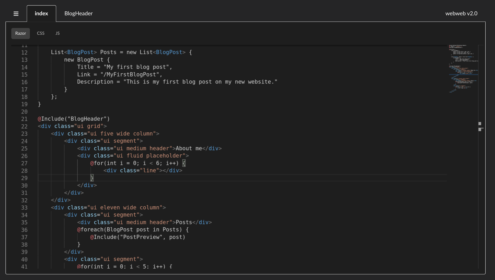

# webweb2

A CMS with a web-based IDE, support for C# Razor syntax, compilation to plain HTML, and the ability to deploy to GitHub Pages or a location on your server.

For documentation, tutorials, and information about webweb2, see [here.](https://www.notion.so/webweb2-5db585b25b6e48fda6fe1db47ea1757a)

## Installation
See the [Getting Started page](https://www.notion.so/Getting-Started-87fc97a6e2b54dc8ae4a02d025c9b7d0) in the documentation.
